 # Advanced Kubernetes Configuration Using Kustomize.

> ## Project Overview

This project demonstrates **Advanced Kustomize Features** such as:
- Base and Overlay configurations
- Transformers and Generators
- ConfigMap and Secret management
- Environment-specific adjustments for **Dev**, **Staging**, and **Production**


## Goal: 
Set up a Kubernetes deployment for an Nginx web server using Kustomize. Customize it for three environments (dev, staging, prod) using overlays, add labels with transformers, and manage settings with ConfigMaps and Secrets.


## Project Structure
```bash
kustomize-nginx
|
├── base/
│   ├── deployment.yaml
│   ├── service.yaml
│   └── kustomization.yaml
└── overlays/
    ├── dev/
    │   ├── kustomization.yaml
    │   └── replica_count.yaml
    ├── staging/
    │   ├── kustomization.yaml
    │   └── replica_count.yaml
    └── prod/
        ├── kustomization.yaml
        └── replica_count.yaml
```

## Prerequisites

Make sure the following tools are installed:

- [Kustomize](https://kubectl.docs.kubernetes.io/installation/kustomize/)
- [kubectl](https://kubernetes.io/docs/tasks/tools/)
- (Optional) Docker, AWS CLI, eksctl — if deploying to cloud
- Text Editor: Recommended **VS Code** with **YAML & Kubernetes extensions**


## Step 1: Create Project Folders 
```bash
mkdir -p kustomize-nginx && cd kustomize-nginx
```

### Create the Base Configuration
- Create a base folder:
```bash
mkdir base
```

### Create a file called `deployment.yaml` inside base:
```bash
touch base/deployment.yaml
```

### Paste this in `deployment.yaml`
```bash
apiVersion: apps/v1
kind: Deployment
metadata:
  name: nginx-deployment
spec:
  replicas: 1
  selector:
    matchLabels:
      app: nginx
  template:
    metadata:
      labels:
        app: nginx
    spec:
      containers:
      - name: nginx
        image: nginx:latest
        ports:
        - containerPort: 80
        volumeMounts:
        - name: nginx-config
          mountPath: /usr/share/nginx/html
      volumes:
      - name: nginx-config
        configMap:
          name: nginx-config
```

## Create a file called `service.yaml` in `base`:
```bash
touch base/service.yaml
```

### Paste this to `service.yaml`:
```bash
apiVersion: v1
kind: Service
metadata:
  name: nginx-service
spec:
  selector:
    app: nginx
  ports:
    - protocol: TCP
      port: 80
      targetPort: 80
  type: ClusterIP
```

## Create a `kustomization.yaml` file in `base`:
```bash
touch base/kustomization.yaml
```

#### Paste this to `base/kustomization.yaml`:
```bash
apiVersion: kustomize.config.k8s.io/v1beta1
kind: Kustomization
resources:
- deployment.yaml
- service.yaml
configMapGenerator:
- name: nginx-config
  literals:
  - welcome_message=Hello from Nginx!
secretGenerator:
- name: nginx-secret
  literals:
  - password=superSecret123
```

## Step 2: Set Up Overlays for Different Environments

- Create folders for each environment:
```bash
mkdir -p overlays/dev overlays/staging overlays/prod
```

### Set up the dev environment:
- Create kustomization.yaml in `overlays/dev`:
```bash
touch overlays/dev/kustomization.yaml
```


#### Paste this to `overlays/dev/kustomization.yaml`:
```bash
apiVersion: kustomize.config.k8s.io/v1beta1
kind: Kustomization
resources:
- ../../base
- configmap.yaml
- service.yaml
patches:
- path: replica_count.yaml
namePrefix: dev-
```

## Create `replica_count.yaml` in `overlays/dev`:
```bash
touch overlays/dev/replica_count.yaml
```

#### Paste this to `replica_count.yaml`:
```bash
apiVersion: apps/v1
kind: Deployment
metadata:
  name: nginx-deployment
spec:
  replicas: 1
  template:
    spec:
      containers:
      - name: nginx
        volumeMounts:
        - name: nginx-config
          mountPath: /usr/share/nginx/html
      volumes:
      - name: nginx-config
        configMap:
          name: dev-specific-nginx-config
```


## Create `service.yaml` in `overlays/dev`:
```bash
touch overlays/dev/service.yaml
```

### Paste
```bash
apiVersion: v1
kind: Service
metadata:
  name: dev-nginx-service
spec:
  selector:
    app: nginx
  ports:
  - protocol: TCP
    port: 80
    targetPort: 80
```


## Create `config.yaml` in `overlays/dev`:
```bash
touch overlays/dev/config.yaml
```

### Paste
```bash
apiVersion: v1
kind: ConfigMap
metadata:
  name: dev-specific-nginx-config
data:
  index.html: |
    <html><body><h1>Welcome to Dev/Staging Castle!</h1></body></html>
```


## Set up the staging environment:

- Create `kustomization.yaml` in `overlays/staging`:
```bash
touch overlays/staging/kustomization.yaml
```

#### Paste this to `overlays/staging/kustomization.yaml`:
```bash
apiVersion: kustomize.config.k8s.io/v1beta1
kind: Kustomization
bases:
- ../../base
patchesStrategicMerge:
- replica_count.yaml
```


## Create `replica_count.yaml` in `overlays/staging`:
```bash
touch overlays/staging/replica_count.yaml
```

#### Paste this to `replica_count.yaml`:
```bash
apiVersion: apps/v1
kind: Deployment
metadata:
  name: nginx-deployment
spec:
  replicas: 2
```


## Set up the `prod` environment:
- Create `kustomization.yaml` in `overlays/prod`:

```bash
touch overlays/prod/kustomization.yaml
```

#### Paste this to `overlays/prod/kustomization.yaml`:
```bash
apiVersion: kustomize.config.k8s.io/v1beta1
kind: Kustomization
bases:
- ../../base
patchesStrategicMerge:
- replica_count.yaml
commonLabels:
  env: production
namePrefix: prod-
```

## Create `replica_count.yaml` in `overlays/prod`:
```bash
touch overlays/prod/replica_count.yaml
```

#### Paste this to `replica_count.yaml`:
```bash
apiVersion: apps/v1
kind: Deployment
metadata:
  name: nginx-deployment
spec:
  replicas: 3
```


## Step 3: Use Transformers and Generators
### 3.1: Add a ConfigMap to the base:

- Open and Update `base/kustomization.yaml`:
```bash
configMapGenerator:
- name: nginx-config
  literals:
  - welcome_message=Hello from Nginx!
```

### 3.2: Update the prod overlay to use transformers:

- Make sure `overlays/prod/kustomization.yaml` has:
```bash
apiVersion: kustomize.config.k8s.io/v1beta1
kind: Kustomization
bases:
- ../../base
patchesStrategicMerge:
- replica_count.yaml
commonLabels:
  env: production
namePrefix: prod-
```

## Step 4: Manage Secrets Safely
- Add a Secret to the base:

#### Open and Update `base/kustomization.yaml`:
```bash
secretGenerator:
  - name: nginx-secret
    literals:
    - password=superSecret123
```

## Step 4.2: Update the deployment` to use the secret:
#### Update `base/deployment.yaml`
```bash
env:
      - name: SECRET_PASSWORD
        valueFrom:
          secretKeyRef:
            name: nginx-secret
            key: password
      - name: WELCOME_MESSAGE
        valueFrom:
          configMapRef:
            name: nginx-config
            key: welcome_message
```


## Step 5: Test Your Setup

#### Verify Installations:
```bash
minikube version
kubectl version --client
docker --version
```
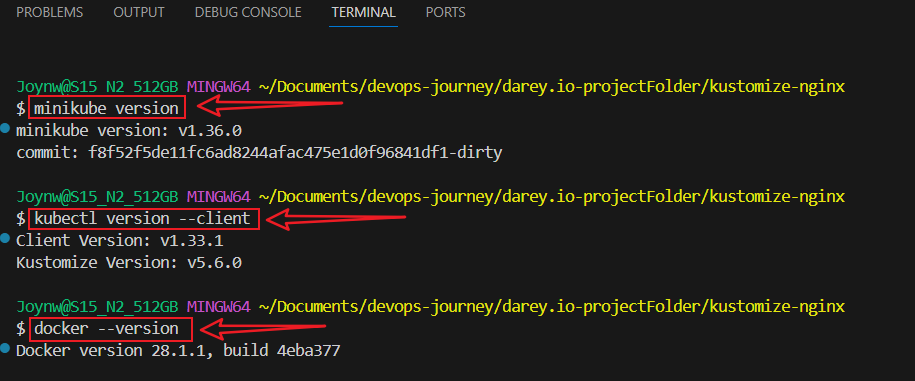


## Step 5.1: Start a Kubernetes cluster:
```bash
minikube start --driver=docker
minikube status
``` 

### Test Kubectl
```bash
kubectl get nodes
```
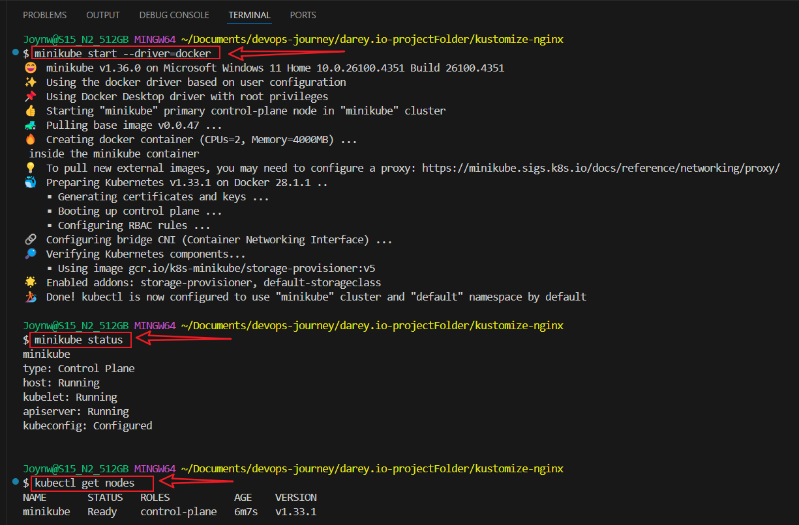


### Run Kustomize to preview the output:
```bash
cd base
kustomize build .
```
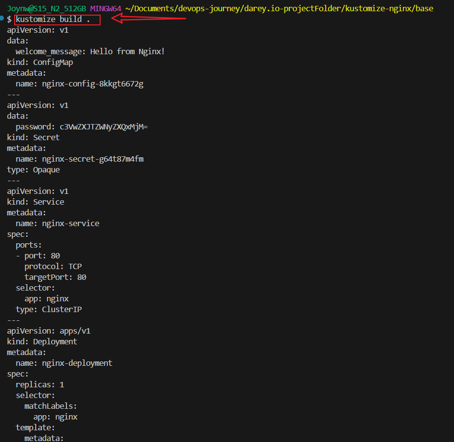
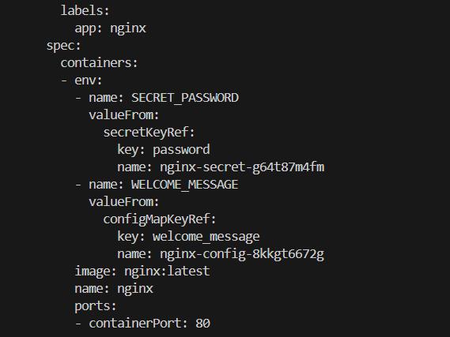


### Test the Build
```bash
kubectl apply -k base/
kubectl get pods -n default -l app=nginx 
minikube service nginx-service -n default
```

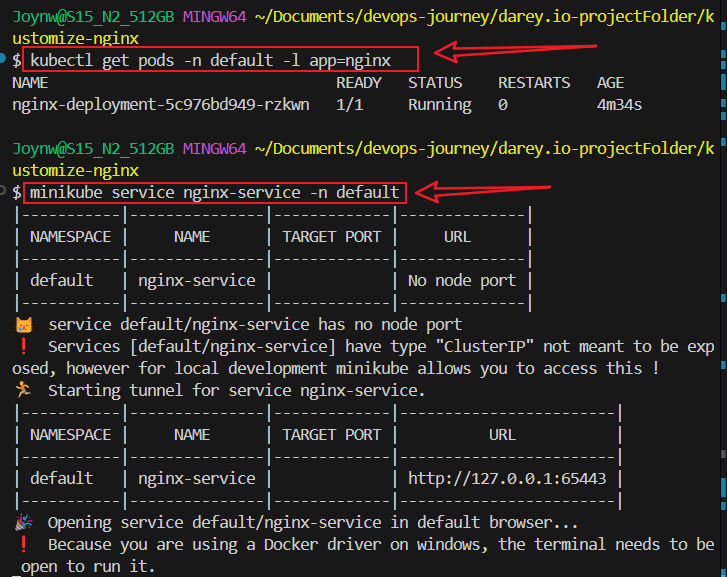
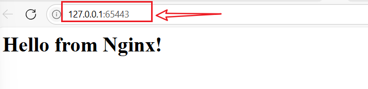


### Apply the `prod` environment:
```bash
kustomize build overlays/prod
kubectl apply -k overlays/prod
minikube service dev-nginx-service -n default
```
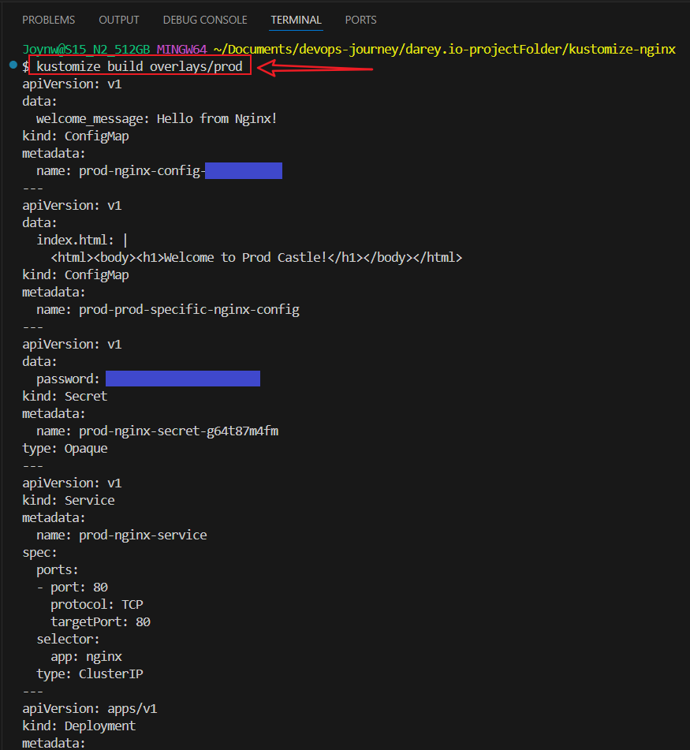
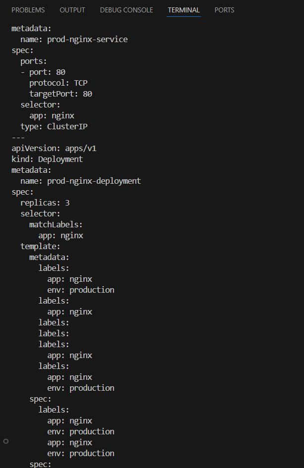
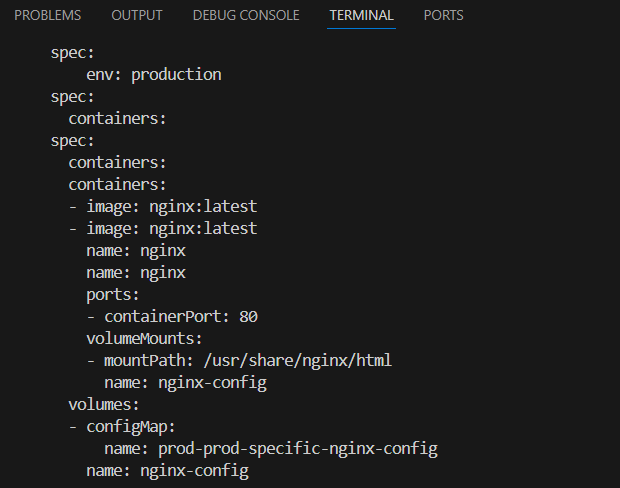
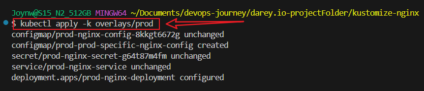
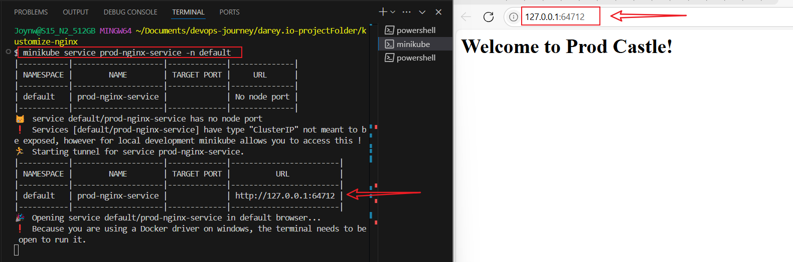


### Check the pods:
```bash
kubectl get pods -n default
```

### Check pods by label:
```bash
kubectl get pods -l env=production
```
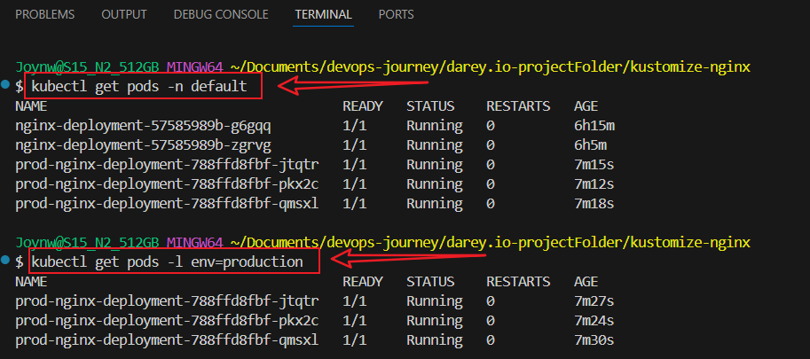


### Visit the service:
```bash
minikube service prod-nginx-service -n default
```


### Test the service:
```bash
kubectl apply -f configmap/nginx-config.yaml
minikube service nginx-service -n default
```
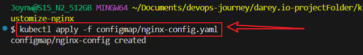


### Apply the dev environment:
```bash
kubectl apply -k overlays/dev
```


### Check `Dev` Pods:
```bash
kubectl get pods -n default
```
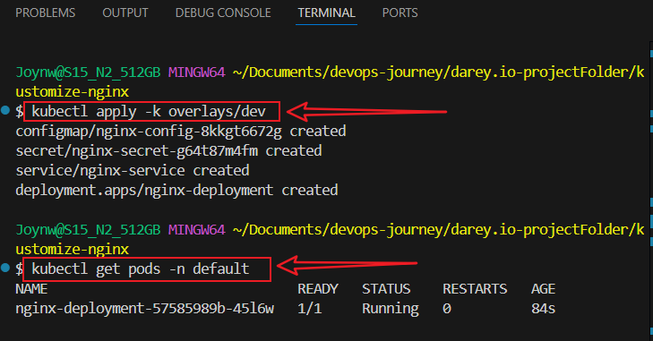


## Create configmap (for dev and staging):
- Create the configmap/ directory:
```bash
mkdir -p configmap
```

### Create configmap/nginx-config.yaml (for dev and staging)
```bash
cat << 'EOF' > configmap/nginx-config.yaml
apiVersion: v1
kind: ConfigMap
metadata:
  name: nginx-config
data:
  index.html: |
    <html><body><h1>Welcome to Dev/Staging Castle!</h1></body></html>
EOF
```

### Create overlays/prod/configmap.yaml (for prod):

```bash
mkdir -p overlays/prod
cat << 'EOF' > overlays/prod/configmap.yaml
apiVersion: v1
kind: ConfigMap
metadata:
  name: prod-nginx-config
data:
  index.html: |
    <html><body><h1>Welcome to Prod Castle!</h1></body></html>
EOF
```


### Apply the dev environments:
```bash
kubectl apply -k overlays/dev
kubectl get pods -n default -l app=nginx
```
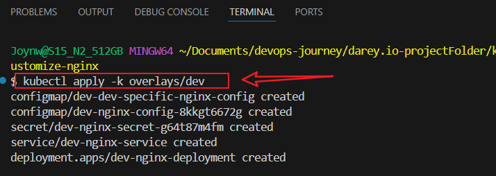
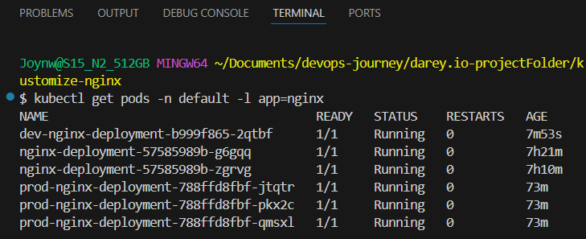
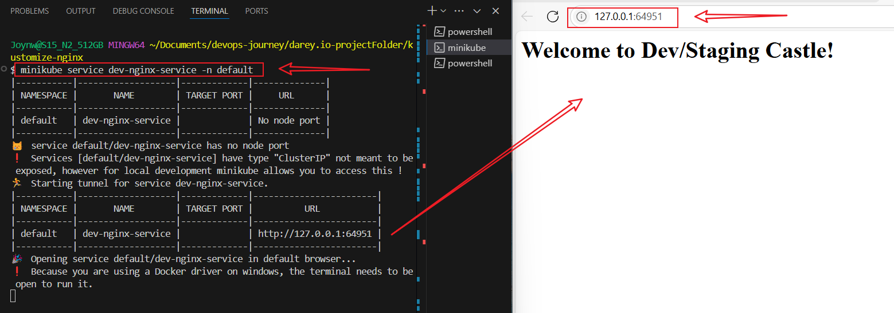


### Apply the Staging Overlay environment
```bash
kubectl apply -k overlays/staging
kubectl get pods -n default -l app=nginx
```
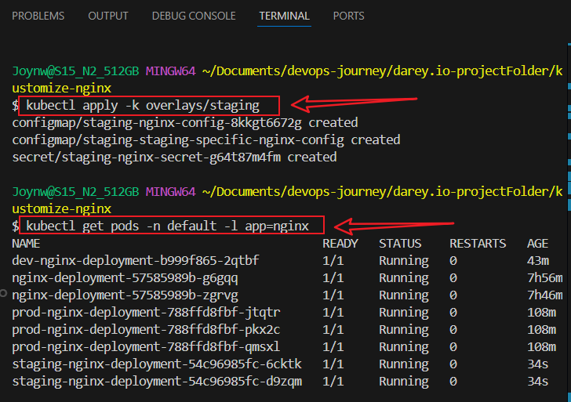

### Reapply:
```bash
kubectl apply -k overlays/staging
```

### Visit the service:
```bash
minikube service staging-nginx-service -n default
```
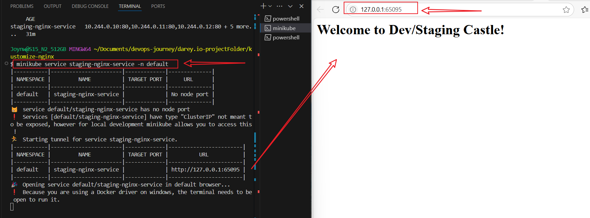


## Step 6: Clean Up
- Delete the environments:
```bash
kubectl delete -k overlays/dev
kubectl delete -k overlays/staging
kubectl delete -k overlays/prod
```

OR

```bash
kubectl delete all --all -n default
kubectl delete configmap --all -n default
kubectl delete secret --all -n default
```


## Stop Minikube:
```bash
minikube stop
minikube delete
```


## Version Control with GitHub:
- Create a repositoy on github

### Initialize the Git repository:
```bash
git init
git add .
git commit -m "Initial Kustomize project"
``` 

### Push to a new GitHub repository
```bash
git branch -m master main
git remote add origin https://github.com/yourusername/your-repository.git
git push -u origin main
```

## Conclusion

In this project, I successfully used Kustomize with Minikube to deploy an Nginx server locally, gaining hands-on experience with reusable Kubernetes configurations and environment-specific overlays. This setup not only helped me understand local service exposure and resource customization, but also built a solid foundation for managing Kubernetes deployments across multiple environments — a key skill for real-world DevOps and cloud-native development.


#### Author
#### Joy Nwatuzor